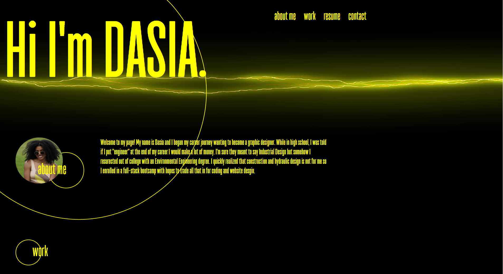

Portfolio

## About

This web application demonstrates my first draft of my professional portfolio that will be builded on as the course progreses. This portfolio showcases current skills to potential
employers with the hopes of eventually adding links to deployable web applications. The portfolio can be found at the following link: https://dasiasmith.github.io/Portfolio-1/

This portofolio utilizes html, CSS, javascript, flexbox, and media queries to showcase a recent photo, my bio, work samples, resume, and contact information. 

The following animation shows the web application's appearance and functionality:

## Credits

[Responsive Hover Cards](https://codepen.io/francisco-kataldo/pen/LBBryV?editors=1100)

## License

MIT
Copyright 2021 Dasia Smith

Permission is hereby granted, free of charge, to any person obtaining a copy of this software and associated documentation files (the "Software"), to deal in the Software without restriction, including without limitation the rights to use, copy, modify, merge, publish, distribute, sublicense, and/or sell copies of the Software, and to permit persons to whom the Software is furnished to do so, subject to the following conditions:

The above copyright notice and this permission notice shall be included in all copies or substantial portions of the Software.

THE SOFTWARE IS PROVIDED "AS IS", WITHOUT WARRANTY OF ANY KIND, EXPRESS OR IMPLIED, INCLUDING BUT NOT LIMITED TO THE WARRANTIES OF MERCHANTABILITY, FITNESS FOR A PARTICULAR PURPOSE AND NONINFRINGEMENT. IN NO EVENT SHALL THE AUTHORS OR COPYRIGHT HOLDERS BE LIABLE FOR ANY CLAIM, DAMAGES OR OTHER LIABILITY, WHETHER IN AN ACTION OF CONTRACT, TORT OR OTHERWISE, ARISING FROM, OUT OF OR IN CONNECTION WITH THE SOFTWARE OR THE USE OR OTHER DEALINGS IN THE SOFTWARE

